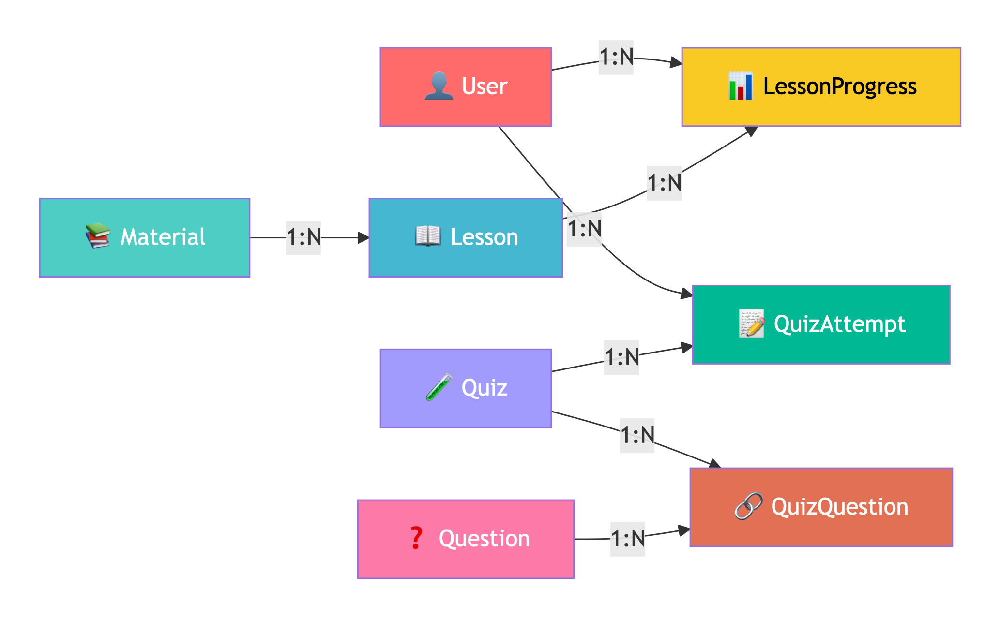
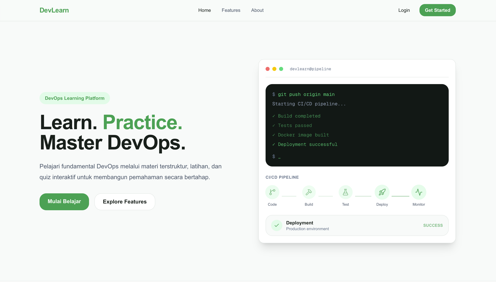
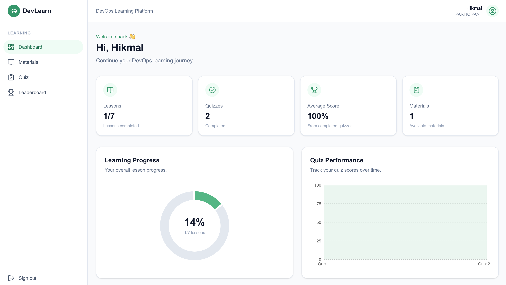
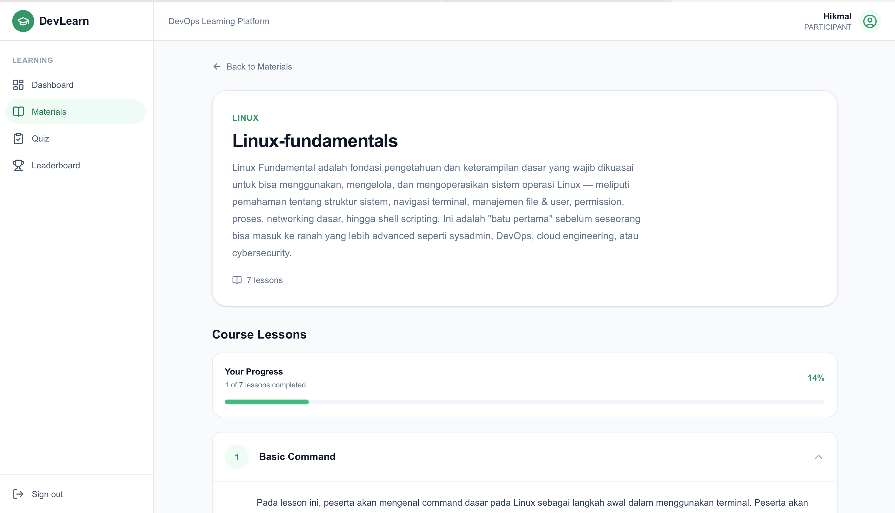
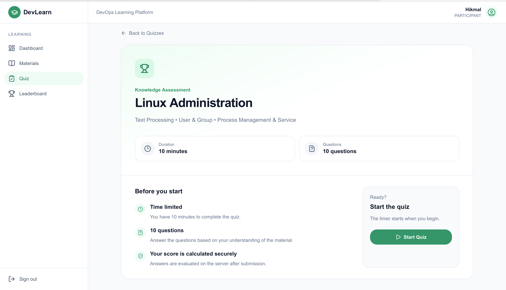

🚀 DevLearn

<p align="center"> </p><h3 align="center"> Interactive Learning Platform for DevOps, Cloud, & Linux </h3><p align="center"> <strong>Learn. Build. Secure.</strong> </p><p align="center">       </p>


📖 About
DevLearn adalah platform pembelajaran interaktif yang dirancang untuk membantu mahasiswa dan pemula mempelajari bidang DevOps, Cloud Computing, Linux, dan Cyber Security melalui kombinasi materi, praktik, dan evaluasi.

## 📂 Project Structure

```text
devlearn/
│
├── app/
│   ├── (auth)/
│   │   ├── login/
│   │   └── register/
│   │
│   ├── dashboard/
│   │
│   ├── admin/
│   │
│   ├── courses/
│   │
│   ├── quiz/
│   │
│   ├── api/
│   │   └── ...
│   │
│   ├── layout.tsx
│   └── page.tsx
│
├── components/
│   ├── ui/
│   ├── dashboard/
│   ├── learning/
│   └── quiz/
│
├── lib/
│   ├── auth/
│   ├── prisma/
│   ├── validation/
│   └── utils/
│
├── prisma/
│   └── schema.prisma
│
├── public/
│   ├── images/
│   └── favicon.ico
│
├── docs/
│   └── images/
│       ├── devlearn-banner.png
│       ├── home.png
│       ├── dashboard.png
│       ├── linux-learning.png
│       ├── quiz.png
│       └── login.png
│
├── .env.example
├── next.config.ts
├── package.json
├── pnpm-lock.yaml
├── tsconfig.json
└── README.md
```

## Features
| Category               | Features                                                  |
| ---------------------- | --------------------------------------------------------- |
| 📚 **Learning**        | Structured Materials, Learning Objectives, Linux Practice |
| 🧪 **Evaluation**      | Quiz, Timer, Learning Progress                            |
| 👤 **User Management** | Authentication, User Profile, Admin & Participant Role    |
| 🛡️ **Security**       | JWT Session, RBAC, Password Hashing, Input Validation     |

## Application Architecture
| Layer             | Technology                   |
| ----------------- | ---------------------------- |
| 🖥️ Frontend      | Next.js, React, TypeScript   |
| 🔐 Authentication | Credentials + JWT            |
| ⚙️ Backend        | Next.js API / Server Actions |
| 🔷 ORM            | Prisma                       |
| 🍃 Database       | MongoDB Atlas                |

## Diagram Relasi 
<p align="center">
  
</p>

## Security 
| Security Area      | Implementation                   |
| ------------------ | -------------------------------- |
| 🔑 Authentication  | Credentials Authentication       |
| 🎫 Session         | JWT-based Session                |
| 🛡️ Authorization  | Role-Based Access Control (RBAC) |
| 🔒 Password        | Password Hashing                 |
| 🚫 Server Security | Server-side Authorization        |
| 🧹 Validation      | Input & Server-side Validation   |
| 🔐 Secrets         | Environment Variables            |
| 🗄️ Database       | Prisma ORM                       |
| 🚧 API Security    | Role-based Endpoint Protection   |

### 🏠 Landing Page
<p align="center">
  
</p>

### 📚 Learning Dashboard
<p align="center">
  
</p>


### 🐧 Linux Learning

<p align="center">
  
</p>

### 🧪 Quiz
<p align="center">
  
</p>

## 🚀 Getting Started

### 1. Clone Repository

```bash
git clone https://github.com/Hikmal-source/e-learning-quiz.git
cd devlearn
